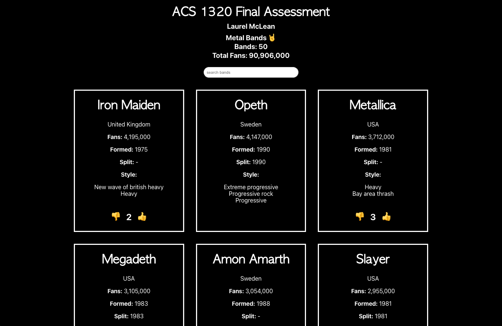

# ACS 1320 Final

Final assignment created in React for ACS 1320 final. The project is made with JavaScript and React, and loads data from a JSON file, create and display components, use state, and use Array.map to create a collection of components.

## To run:

In the project directory, you can run:

### `npm start`

Runs the app in the development mode.\
Open [http://localhost:3000](http://localhost:3000) to view it in your browser.

## GitHub Pages:

https://laurelmclean.github.io/ACS-1320-final/

## Screenshot:

